<!-- PROJECT LOGO -->

    
  <h3 align="center">LF Tools</h3>
  

    <b><i>Tools for cartographic production, surveying, digital image processing and spatial analysis</i><b>
     
  

<!-- TABLE OF CONTENTS -->

  
Set of Tools

  <ol>
    <li>
      <a href="#cartography">Cartography</a>
      <ul>
        <li><a href="#coordinates-to-utm-grid">Coordinates to UTM Grid</a></li>
      </ul>
      <ul>
        <li><a href="#extent-to-utm-grids">Extent to UTM Grids</a></li>
      </ul>
      <ul>
        <li><a href="#name-to-utm-grid">Name to UTM Grid</a></li>
      </ul>
      </li><li>
      <a href="#documents">Documents</a>
      <ul>
        <li><a href="#area-and-perimeter-report">Area and Perimeter Report</a></li>
      </ul>
      <ul>
        <li><a href="#descriptive-memorial">Descriptive Memorial</a></li>
      </ul>
      <ul>
        <li><a href="#descriptive-table-of-vertices-and-sides">Descriptive table of vertices and sides</a></li>
      </ul>
      <ul>
        <li><a href="#geodetic-landmark-informations">Geodetic Landmark Informations</a></li>
      </ul>
      </li><li>
      <a href="#easy">Easy</a>
      <ul>
        <li><a href="#coordinates-to-layer">Coordinates to Layer</a></li>
      </ul>
      <ul>
        <li><a href="#measure-layers">Measure Layers</a></li>
      </ul>
      </li><li>
      <a href="#postgis">PostGIS</a>
      <ul>
        <li><a href="#backup-database">Backup database</a></li>
      </ul>
      <ul>
        <li><a href="#change-sql-encoding">Change SQL encoding</a></li>
      </ul>
      <ul>
        <li><a href="#clone-database">Clone database</a></li>
      </ul>
      <ul>
        <li><a href="#delete-database">Delete database</a></li>
      </ul>
      <ul>
        <li><a href="#import-raster">Import Raster</a></li>
      </ul>
      <ul>
        <li><a href="#rename-database">Rename database</a></li>
      </ul>
      <ul>
        <li><a href="#restore-database">Restore database</a></li>
      </ul>
      </li><li>
      <a href="#raster">Raster</a>
      <ul>
        <li><a href="#create-holes-in-raster">Create holes in raster</a></li>
      </ul>
      <ul>
        <li><a href="#define-null-cells">Define null cells</a></li>
      </ul>
      <ul>
        <li><a href="#extract-raster-band">Extract raster band</a></li>
      </ul>
      <ul>
        <li><a href="#fill-with-patches">Fill with patches</a></li>
      </ul>
      <ul>
        <li><a href="#jpeg-compress">JPEG Compress</a></li>
      </ul>
      <ul>
        <li><a href="#load-raster-by-location">Load Raster by Location</a></li>
      </ul>
      <ul>
        <li><a href="#mosaic-raster">Mosaic raster</a></li>
      </ul>
      <ul>
        <li><a href="#rgb-composite">RGB Composite</a></li>
      </ul>
      <ul>
        <li><a href="#raster-data-inventory">Raster data inventory</a></li>
      </ul>
      <ul>
        <li><a href="#remove-alpha-band">Remove alpha band</a></li>
      </ul>
      <ul>
        <li><a href="#rescale-to-8-bit">Rescale to 8 bit</a></li>
      </ul>
      <ul>
        <li><a href="#supervised-classification">Supervised classification</a></li>
      </ul>
      </li><li>
      <a href="#reambulation">Reambulation</a>
      <ul>
        <li><a href="#photos-with-geotag">Photos with Geotag</a></li>
      </ul>
      </li><li>
      <a href="#spatial-statistics">Spatial Statistics</a>
      <ul>
        <li><a href="#confidence-ellipses">Confidence Ellipses</a></li>
      </ul>
      <ul>
        <li><a href="#gaussian-random-points">Gaussian Random Points</a></li>
      </ul>
      </li><li>
      <a href="#survey">Survey</a>
      <ul>
        <li><a href="#2d-conformal-transformation">2D Conformal Transformation</a></li>
      </ul>
      <ul>
        <li><a href="#azimuth-and-distance">Azimuth and Distance</a></li>
      </ul>
      <ul>
        <li><a href="#closed-polygonal">Closed Polygonal</a></li>
      </ul>
      <ul>
        <li><a href="#estimate-3d-coordinates">Estimate 3D Coordinates</a></li>
      </ul>
      <ul>
        <li><a href="#local-geodetic-system-transform">Local Geodetic System Transform</a></li>
      </ul>
      <ul>
        <li><a href="#traverse-adjustment">Traverse Adjustment</a></li>
      </ul>
      </li><li>
      <a href="#vector">Vector</a>
      <ul>
        <li><a href="#calculate-polygon-angles">Calculate polygon angles</a></li>
      </ul>
      <ul>
        <li><a href="#extend-lines">Extend lines</a></li>
      </ul>
      <ul>
        <li><a href="#merge-lines-in-direction">Merge lines in direction</a></li>
      </ul>
      <ul>
        <li><a href="#reverse-vertex-order">Reverse vertex order</a></li>
      </ul>
      <ul>
        <li><a href="#sequence-points">Sequence points</a></li>
      </ul>
      </li>
  </ol>

<!-- TABLE OF CONTENTS -->

  
Conjunto de Ferramentas (Portuguese-BR)

  <ol>
    <li>
      <a href="#agrimensura">Agrimensura</a>
      <ul>
        <li><a href="#azimute-e-distância">Azimute e Distância</a></li>
      </ul>
      <ul>
        <li><a href="#estimar-coordenadas-3d">Estimar Coordenadas 3D</a></li>
      </ul>
      <ul>
        <li><a href="#poligonal-enquadrada">Poligonal Enquadrada</a></li>
      </ul>
      <ul>
        <li><a href="#poligonal-fechada">Poligonal Fechada</a></li>
      </ul>
      <ul>
        <li><a href="#transformação-conforme-2d">Transformação Conforme 2D</a></li>
      </ul>
      <ul>
        <li><a href="#transformação-para-sgl">Transformação para SGL</a></li>
      </ul>
      </li><li>
      <a href="#cartografia">Cartografia</a>
      <ul>
        <li><a href="#coordenadas-para-moldura-utm">Coordenadas para Moldura UTM</a></li>
      </ul>
      <ul>
        <li><a href="#extensão-para-molduras-utm">Extensão para Molduras UTM</a></li>
      </ul>
      <ul>
        <li><a href="#nome-para-moldura-utm">Nome para Moldura UTM</a></li>
      </ul>
      </li><li>
      <a href="#documentos">Documentos</a>
      <ul>
        <li><a href="#memorial-descritivo">Memorial Descritivo</a></li>
      </ul>
      <ul>
        <li><a href="#memorial-sintético">Memorial Sintético</a></li>
      </ul>
      <ul>
        <li><a href="#monografia-de-marco-geodésico">Monografia de Marco Geodésico</a></li>
      </ul>
      <ul>
        <li><a href="#planilha-de-área-e-perímetro">Planilha de Área e Perímetro</a></li>
      </ul>
      </li><li>
      <a href="#estatística-espacial">Estatística Espacial</a>
      <ul>
        <li><a href="#elipses-de-confiança">Elipses de Confiança</a></li>
      </ul>
      <ul>
        <li><a href="#pontos-aleatórios-gaussiano">Pontos Aleatórios Gaussiano</a></li>
      </ul>
      </li><li>
      <a href="#mão-na-roda">Mão na Roda</a>
      <ul>
        <li><a href="#coordenadas-para-camada">Coordenadas para Camada</a></li>
      </ul>
      <ul>
        <li><a href="#medir-camadas">Medir Camadas</a></li>
      </ul>
      </li><li>
      <a href="#postgis">PostGIS</a>
      <ul>
        <li><a href="#backup-de-bd">Backup de BD</a></li>
      </ul>
      <ul>
        <li><a href="#clonar-bd">Clonar BD</a></li>
      </ul>
      <ul>
        <li><a href="#deletar-bd">Deletar BD</a></li>
      </ul>
      <ul>
        <li><a href="#importar-raster">Importar Raster</a></li>
      </ul>
      <ul>
        <li><a href="#renomear-bd">Renomear BD</a></li>
      </ul>
      <ul>
        <li><a href="#restaurar-bd">Restaurar BD</a></li>
      </ul>
      <ul>
        <li><a href="#trocar-codificação-de-sql">Trocar codificação de SQL</a></li>
      </ul>
      </li><li>
      <a href="#raster">Raster</a>
      <ul>
        <li><a href="#carregar-raster-pela-localização">Carregar raster pela localização</a></li>
      </ul>
      <ul>
        <li><a href="#classificação-supervisionada">Classificação supervisionada</a></li>
      </ul>
      <ul>
        <li><a href="#composição-rgb">Composição RGB</a></li>
      </ul>
      <ul>
        <li><a href="#compressão-jpeg">Compressão JPEG</a></li>
      </ul>
      <ul>
        <li><a href="#definir-pixel-nulo">Definir pixel nulo</a></li>
      </ul>
      <ul>
        <li><a href="#esburacar-raster">Esburacar raster</a></li>
      </ul>
      <ul>
        <li><a href="#extrair-banda-de-raster">Extrair banda de raster</a></li>
      </ul>
      <ul>
        <li><a href="#inventário-de-dados-raster">Inventário de dados raster</a></li>
      </ul>
      <ul>
        <li><a href="#mosaicar-raster">Mosaicar raster</a></li>
      </ul>
      <ul>
        <li><a href="#reescalonar-para-8-bits">Reescalonar para 8 bits</a></li>
      </ul>
      <ul>
        <li><a href="#remendar-vazios-de-raster">Remendar vazios de raster</a></li>
      </ul>
      <ul>
        <li><a href="#remover-banda-alfa">Remover banda alfa</a></li>
      </ul>
      </li><li>
      <a href="#reambulação">Reambulação</a>
      <ul>
        <li><a href="#fotos-com-geotag">Fotos com Geotag</a></li>
      </ul>
      </li><li>
      <a href="#vetor">Vetor</a>
      <ul>
        <li><a href="#calcular-ângulos-de-polígono">Calcular ângulos de polígono</a></li>
      </ul>
      <ul>
        <li><a href="#estender-linhas">Estender linhas</a></li>
      </ul>
      <ul>
        <li><a href="#inverter-ordem-dos-vértices">Inverter ordem dos vértices</a></li>
      </ul>
      <ul>
        <li><a href="#mesclar-linhas-na-direção">Mesclar linhas na direção</a></li>
      </ul>
      <ul>
        <li><a href="#sequenciar-pontos">Sequenciar pontos</a></li>
      </ul>
      </li>
  </ol>

## Cartography

### Coordinates to UTM Grid
This algorithm returns the frame related to a scale of the Brazilian Mapping System. The generated frame, which is a polygon, is calculated from a Point defined by the user.

<table style="text-align: left; width: 275px;" border="0" cellpadding="0" cellspacing="0">
  <tbody>
    <tr>
      <td>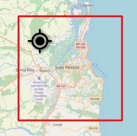</td>
    </tr>
  </tbody>
</table>

### Extent to UTM Grids
This algorithm returns the polygons correspondent to the <b>frames</b> related to a scale of the Brazilian Mapping System from a specific <b>extent</b> definied by the user.

<table style="text-align: left; width: 275px;" border="0" cellpadding="0" cellspacing="0">
  <tbody>
    <tr>
      <td>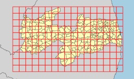</td>
    </tr>
  </tbody>
</table>

### Name to UTM Grid
This algorithm returns the polygon correspondent to the frame related to a scale of the Brazilian Mapping System based on the Map Index (MI). Example: MI = 1214-1

<table style="text-align: left; width: 275px;" border="0" cellpadding="0" cellspacing="0">
  <tbody>
    <tr>
      <td>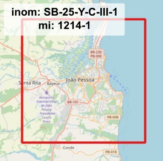</td>
    </tr>
  </tbody>
</table>

## Documents

### Area and Perimeter Report
This tool generates a Report for the Analytical Calculation of Area, Azimuths, Polygon Sides, UTM Projection and Geodetic Coordinates of a Property.

<table style="text-align: left; width: 275px;" border="0" cellpadding="0" cellspacing="0">
  <tbody>
    <tr>
      <td>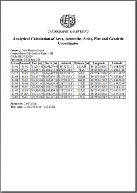</td>
    </tr>
  </tbody>
</table>

### Descriptive Memorial
Elaboration of Descriptive Memorials based on vector layers that define a property.

<table style="text-align: left; width: 275px;" border="0" cellpadding="0" cellspacing="0">
  <tbody>
    <tr>
      <td>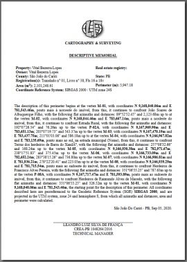</td>
    </tr>
  </tbody>
</table>

### Descriptive table of vertices and sides
This tool generates the Vertices and Sides Descriptive Table , also known as Synthetic Descriptive Memorial, based on the attributes, sequence and code, in the point layer's attribute table.

<table style="text-align: left; width: 275px;" border="0" cellpadding="0" cellspacing="0">
  <tbody>
    <tr>
      <td>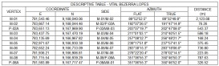</td>
    </tr>
  </tbody>
</table>

### Geodetic Landmark Informations
This tool generates monograph(s) of geodetic landmarks automatically from the "pto_ref_geod_topo_p" layer.

<table style="text-align: left; width: 275px;" border="0" cellpadding="0" cellspacing="0">
  <tbody>
    <tr>
      <td>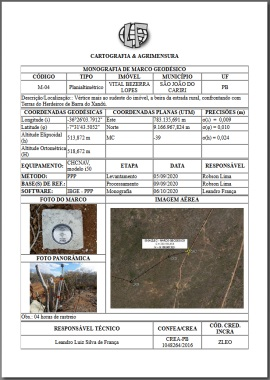</td>
    </tr>
  </tbody>
</table>

## Easy

### Coordinates to Layer
Generates a <b>point layer</b> from a coordinate table, whether it comes from a Microsoft <b>Excel</b> spreadsheet, Open Document Spreadsheet (ODS), or even attributes from another layer.

<table style="text-align: left; width: 275px;" border="0" cellpadding="0" cellspacing="0">
  <tbody>
    <tr>
      <td>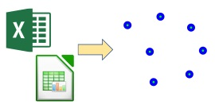</td>
    </tr>
  </tbody>
</table>

### Measure Layers
This tool calculates the line feature's lengths and polygon feature's perimeter and area in virtual fields for all vector layers.

<table style="text-align: left; width: 275px;" border="0" cellpadding="0" cellspacing="0">
  <tbody>
    <tr>
      <td>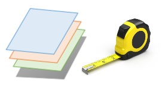</td>
    </tr>
  </tbody>
</table>

## PostGIS

### Backup database
This tool creates a <b>backup</b> file in the "<b>.sql</b>" format for a PostgreSQL server database.

<table style="text-align: left; width: 275px;" border="0" cellpadding="0" cellspacing="0">
  <tbody>
    <tr>
      <td></td>
    </tr>
  </tbody>
</table>

### Change SQL encoding
This tool changes the encoding type of a .sql file. A new file will be created with the user-defined encoding. In some cases, this is a possible solution  to transfer data between different operating systems, for example from Windows to Linux, and vice versa.

<table style="text-align: left; width: 275px;" border="0" cellpadding="0" cellspacing="0">
  <tbody>
    <tr>
      <td>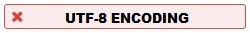</td>
    </tr>
  </tbody>
</table>

### Clone database
This tool allows you to clone any PostgreSQL database. From a model database, another database that is exactly the same (schema and instances) is generated with a new name defined by the operator. Note: To create more than one "clone", the new bank names must be filled in separated by a "comma".

<table style="text-align: left; width: 275px;" border="0" cellpadding="0" cellspacing="0">
  <tbody>
    <tr>
      <td>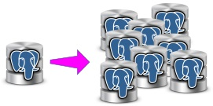</td>
    </tr>
  </tbody>
</table>

### Delete database
This tool allows you to delete / drop any PostgreSQL database. Notes: - To perform this operation, it is necessary that the database is disconnected, that is, it is not open in any software (PgAdmin, QGIS, etc.). - To delete more than one database, the names must be filled in separated by a "comma". 
Attention: This operation is irreversible, so be sure when performing it!

<table style="text-align: left; width: 275px;" border="0" cellpadding="0" cellspacing="0">
  <tbody>
    <tr>
      <td></td>
    </tr>
  </tbody>
</table>

### Import Raster
This tool allows you to load a raster layer into a PostGIS database.

<table style="text-align: left; width: 275px;" border="0" cellpadding="0" cellspacing="0">
  <tbody>
    <tr>
      <td></td>
    </tr>
  </tbody>
</table>

### Rename database
This tool allows you to rename a PostgreSQL database. Note: To perform this operation, it is necessary that the database is disconnected, that is, it is not open in any software (PgAdmin, QGIS, etc.).

<table style="text-align: left; width: 275px;" border="0" cellpadding="0" cellspacing="0">
  <tbody>
    <tr>
      <td></td>
    </tr>
  </tbody>
</table>

### Restore database
This tool allows you to <b>restore</b>, that is, import a database on a PostgreSQL server, from a backup file in the "<b>.sql</b>" format.

<table style="text-align: left; width: 275px;" border="0" cellpadding="0" cellspacing="0">
  <tbody>
    <tr>
      <td>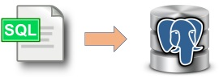</td>
    </tr>
  </tbody>
</table>

## Raster

### Create holes in raster
Creates holes in Raster by defining "no data" pixels (transparent) from the Polygon Layer.

<table style="text-align: left; width: 275px;" border="0" cellpadding="0" cellspacing="0">
  <tbody>
    <tr>
      <td>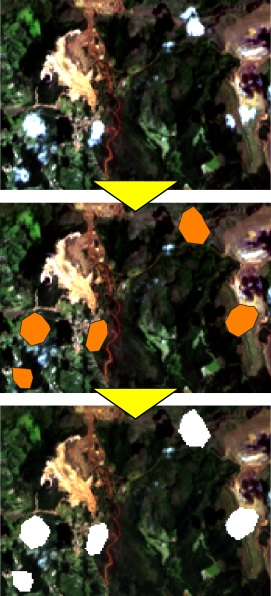</td>
    </tr>
  </tbody>
</table>

### Define null cells
Cells of a raster with values outside the interval (minimum and maximum) are defined as null value.

<table style="text-align: left; width: 275px;" border="0" cellpadding="0" cellspacing="0">
  <tbody>
    <tr>
      <td>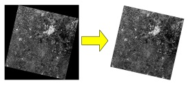</td>
    </tr>
  </tbody>
</table>

### Extract raster band
Extracts a difined band of a raster (for multiband rasters).

<table style="text-align: left; width: 275px;" border="0" cellpadding="0" cellspacing="0">
  <tbody>
    <tr>
      <td>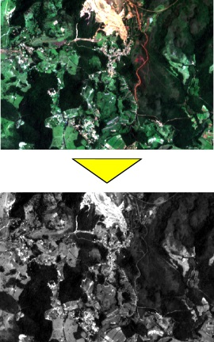</td>
    </tr>
  </tbody>
</table>

### Fill with patches
Fills Raster null pixels (no data) with data obtained from other smaller raster layers (Patches).

<table style="text-align: left; width: 275px;" border="0" cellpadding="0" cellspacing="0">
  <tbody>
    <tr>
      <td>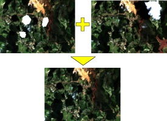</td>
    </tr>
  </tbody>
</table>

### JPEG Compress
JPEG compression is a lossy method to reduce the raster file size (about to 10%). The degree of compression can be adjusted, allowing a selectable tradeoff between storage size and image quality.

<table style="text-align: left; width: 275px;" border="0" cellpadding="0" cellspacing="0">
  <tbody>
    <tr>
      <td>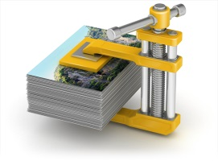</td>
    </tr>
  </tbody>
</table>

### Load Raster by Location
Loads a set of raster files that intersect the geometries of an input vector layer.

<table style="text-align: left; width: 275px;" border="0" cellpadding="0" cellspacing="0">
  <tbody>
    <tr>
      <td>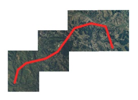</td>
    </tr>
  </tbody>
</table>

### Mosaic raster
Creates raster mosaic: a combination or merge of two or more images.

<table style="text-align: left; width: 275px;" border="0" cellpadding="0" cellspacing="0">
  <tbody>
    <tr>
      <td>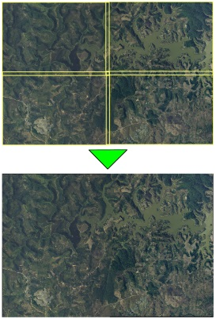</td>
    </tr>
  </tbody>
</table>

### RGB Composite
Combine three image bands into one picture by display each band as either Red, Green or Blue.

<table style="text-align: left; width: 275px;" border="0" cellpadding="0" cellspacing="0">
  <tbody>
    <tr>
      <td>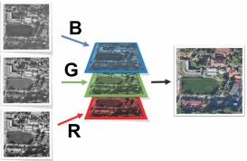</td>
    </tr>
  </tbody>
</table>

### Raster data inventory
Creates a vector layer with the inventory of raster files in a folder. The geometry type of the features of this layer can be Polygon (bounding box) or Point (centroid).

<table style="text-align: left; width: 275px;" border="0" cellpadding="0" cellspacing="0">
  <tbody>
    <tr>
      <td>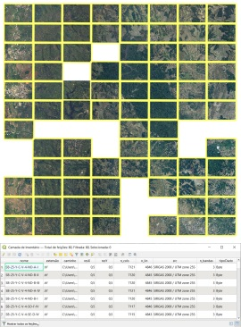</td>
    </tr>
  </tbody>
</table>

### Remove alpha band
This tool removes the 4th band (apha band), transfering the transparency information as "NoData" to pixels of the RGB output.

<table style="text-align: left; width: 275px;" border="0" cellpadding="0" cellspacing="0">
  <tbody>
    <tr>
      <td>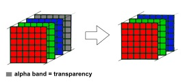</td>
    </tr>
  </tbody>
</table>

### Rescale to 8 bit
Rescales the values of the raster pixels with radiometric resolution of 16 bits (or even 8 bits or float) to exactly the range of 0 to 255, creating a new raster with 8 bits (byte) of radiometric resolution.

<table style="text-align: left; width: 275px;" border="0" cellpadding="0" cellspacing="0">
  <tbody>
    <tr>
      <td>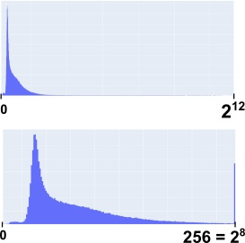</td>
    </tr>
  </tbody>
</table>

### Supervised classification
Performs the supervised classification of a raster layer with two or more bands.

<table style="text-align: left; width: 275px;" border="0" cellpadding="0" cellspacing="0">
  <tbody>
    <tr>
      <td>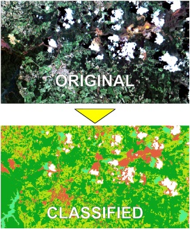</td>
    </tr>
  </tbody>
</table>

## Reambulation

### Photos with Geotag
Imports photos with geotag to a Point Layer.

<table style="text-align: left; width: 275px;" border="0" cellpadding="0" cellspacing="0">
  <tbody>
    <tr>
      <td>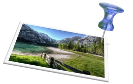</td>
    </tr>
  </tbody>
</table>

## Spatial Statistics

### Confidence Ellipses
Creates ellipses based on the covariance matrix to summarize the spatial characteristics of point type geographic features: central tendency, dispersion, and directional trends.

<table style="text-align: left; width: 275px;" border="0" cellpadding="0" cellspacing="0">
  <tbody>
    <tr>
      <td>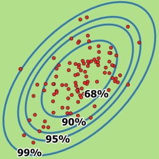</td>
    </tr>
  </tbody>
</table>

### Gaussian Random Points
Generate gaussian (normal) random points in 2D space with a given mean position (X0, Y0), standard deviation for X and Y, and rotation angle.

<table style="text-align: left; width: 275px;" border="0" cellpadding="0" cellspacing="0">
  <tbody>
    <tr>
      <td>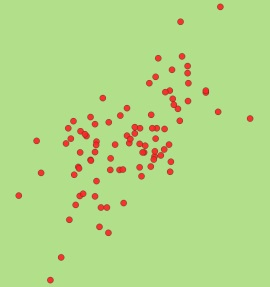</td>
    </tr>
  </tbody>
</table>

## Survey

### 2D Conformal Transformation
Two-dimensional conformal coordinate transformation, also known as the four-parameter similarity transformation or Helmert 2D, has the characteristic that true shape is retained after transformation. It is typically used in surveying when converting separate surveys into a common reference coordinate system. This transformation involves: Scaling, Rotation and Translations. 

<table style="text-align: left; width: 275px;" border="0" cellpadding="0" cellspacing="0">
  <tbody>
    <tr>
      <td>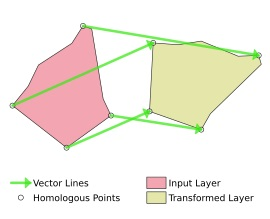</td>
    </tr>
  </tbody>
</table>

### Azimuth and Distance
Calculation of points or line from a set of azimuths and distances.

<table style="text-align: left; width: 275px;" border="0" cellpadding="0" cellspacing="0">
  <tbody>
    <tr>
      <td>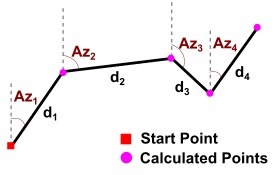</td>
    </tr>
  </tbody>
</table>

### Closed Polygonal
Calculates the adjusted coordinates from angles and horizontal distances of a Closed Polygonal.

<table style="text-align: left; width: 275px;" border="0" cellpadding="0" cellspacing="0">
  <tbody>
    <tr>
      <td>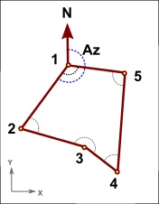</td>
    </tr>
  </tbody>
</table>

### Estimate 3D Coordinates
This tool calculates the coordinates (X, Y, Z) of a point from azimuth and zenith angle measurements observed from two or more stations with known coordinates using the Foward Intersection Method adjusted by the Minimum Distances.

<table style="text-align: left; width: 275px;" border="0" cellpadding="0" cellspacing="0">
  <tbody>
    <tr>
      <td></td>
    </tr>
  </tbody>
</table>

### Local Geodetic System Transform
 This algorithm transforms coordinates between the following reference systems: - geodetic <b>(λ, ϕ, h)</b>; - geocentric or ECEF <b>(X, Y, Z)</b>; and - topocentric in a local tangent plane <b>(E, N, U)</b>. Default values for origin coordinates can be applied to Recife / Brazil.

<table style="text-align: left; width: 275px;" border="0" cellpadding="0" cellspacing="0">
  <tbody>
    <tr>
      <td>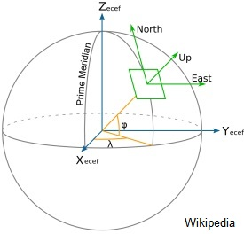</td>
    </tr>
  </tbody>
</table>

### Traverse Adjustment
This algorithm performs the traverse adjustments of a framed polygonal by least squares method, where  the distances, angles, and directions observations are adjusted simultaneously, providing the most probable values for the given data set.  Futhermore, the observations can be rigorously weighted based on their estimated errors and adjusted accordingly.

<table style="text-align: left; width: 275px;" border="0" cellpadding="0" cellspacing="0">
  <tbody>
    <tr>
      <td>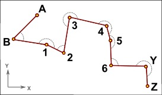</td>
    </tr>
  </tbody>
</table>

## Vector

### Calculate polygon angles
This algorithm calculates the inner and outer angles of the polygon vertices of a layer. The output layer corresponds to the points with the calculated angles stored in the respective attributes.

<table style="text-align: left; width: 275px;" border="0" cellpadding="0" cellspacing="0">
  <tbody>
    <tr>
      <td>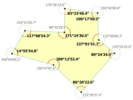</td>
    </tr>
  </tbody>
</table>

### Extend lines
Extends lines at their <b>start</b> and/or <b>end</b> points.

<table style="text-align: left; width: 275px;" border="0" cellpadding="0" cellspacing="0">
  <tbody>
    <tr>
      <td>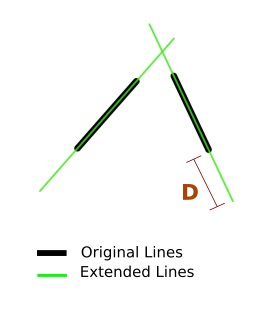</td>
    </tr>
  </tbody>
</table>

### Merge lines in direction
This algorithm merges lines that touch at their starting or ending points and has the same direction (given a tolerance in degrees). 
For the attributes can be considered:
1 - merge lines that have the same attributes; or</li><li>2 - keep the attributes of the longest line.</li>

<table style="text-align: left; width: 275px;" border="0" cellpadding="0" cellspacing="0">
  <tbody>
    <tr>
      <td>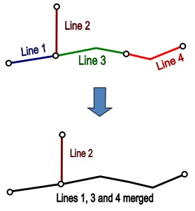</td>
    </tr>
  </tbody>
</table>

### Reverse vertex order
Inverts vertex order for polygons and lines.

<table style="text-align: left; width: 275px;" border="0" cellpadding="0" cellspacing="0">
  <tbody>
    <tr>
      <td>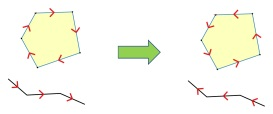</td>
    </tr>
  </tbody>
</table>

### Sequence points
This script fills a certain attribute of the features of a layer of points according to its sequence in relation to the polygon of another layer.

<table style="text-align: left; width: 275px;" border="0" cellpadding="0" cellspacing="0">
  <tbody>
    <tr>
      <td>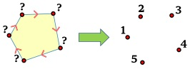</td>
    </tr>
  </tbody>
</table>

## Agrimensura

### Azimute e Distância
Cálculo de pontos ou linha a partir de um conjunto de azimutes e distâncias.

<table style="text-align: left; width: 275px;" border="0" cellpadding="0" cellspacing="0">
  <tbody>
    <tr>
      <td></td>
    </tr>
  </tbody>
</table>

### Estimar Coordenadas 3D
Esta ferramenta calcula as coordenadas (X,Y,Z) de um ponto a partir de medições de azimute e ângulo zenital observados de duas ou mais estações de coordenadas conhecidas utilizando o Método de Interseção à Vante ajustado pelas Distâncias Mínimas.

<table style="text-align: left; width: 275px;" border="0" cellpadding="0" cellspacing="0">
  <tbody>
    <tr>
      <td></td>
    </tr>
  </tbody>
</table>

### Poligonal Enquadrada
Este algoritmo realiza o ajustamento de poligonal enquadrada pelo método dos mínimos quadrados, onde as observações de distâncias, ângulos e direções são ajustadas simultaneamente, fornecendo os valores mais prováveis para o conjunto de dados. Além disso, as observações podem ser rigorosamente ponderadas considerando os erros estimados e ajustados.

<table style="text-align: left; width: 275px;" border="0" cellpadding="0" cellspacing="0">
  <tbody>
    <tr>
      <td></td>
    </tr>
  </tbody>
</table>

### Poligonal Fechada
Cálculo das coordenadas ajustadas a partir de medições de ângulos e distâncias de uma poligonal fechada.

<table style="text-align: left; width: 275px;" border="0" cellpadding="0" cellspacing="0">
  <tbody>
    <tr>
      <td></td>
    </tr>
  </tbody>
</table>

### Transformação Conforme 2D
A transformação Conforme, também conhecida como transformação de similaridade de quatro parâmetros ou Helmert 2D, tem a característica de manter a forma (configuração) verdadeira da feição após a transformação. É normalmente utilizada para o correto georreferenciamento de levantamentos topográficos com coordenadas arbitrárias. Esta transformação envolve: Escala, Rotação e Translação. 

<table style="text-align: left; width: 275px;" border="0" cellpadding="0" cellspacing="0">
  <tbody>
    <tr>
      <td></td>
    </tr>
  </tbody>
</table>

### Transformação para SGL
Este algoritmo transforma coordenadas entre os seguintes sistemas de referência: - Geodésico <b>(λ, ϕ, h)</b> - Geocêntrico ou ECEF <b>(X, Y, Z)</b>; - Topocêntrico <b>(E, N, U)</b>. Default: coordenadas de origem para Recife-PE, Brasil.

<table style="text-align: left; width: 275px;" border="0" cellpadding="0" cellspacing="0">
  <tbody>
    <tr>
      <td></td>
    </tr>
  </tbody>
</table>

## Cartografia

### Coordenadas para Moldura UTM
Este algoritmo retorna o polígono correspondente à <b>moldura</b> relativa a uma escala do <b>Mapeamento Sistemático Brasileiro</b>. Esta moldura é calculada a partir das coordenadas de um <b>Ponto</b> definido pelo usuário.

<table style="text-align: left; width: 275px;" border="0" cellpadding="0" cellspacing="0">
  <tbody>
    <tr>
      <td></td>
    </tr>
  </tbody>
</table>

### Extensão para Molduras UTM
Este algoritmo retorna os polígonos correspondentes às molduras relacionadas a uma escala do Mapeamento Sistemático Brasileiro para uma extensão específica definida pelo usuário.

<table style="text-align: left; width: 275px;" border="0" cellpadding="0" cellspacing="0">
  <tbody>
    <tr>
      <td></td>
    </tr>
  </tbody>
</table>

### Nome para Moldura UTM
Este algoritmo retorna o polígono correspondente à <b>moldura</b> relativa a uma escala do <b>Mapeamento Sistemático Brasileiro</b>. Esta moldura é calculada a partir do Índice de Nomenclatura <b>INOM</b> ou Mapa Índice <b>MI</b> válido, que deve ser dado pelo usuário.

<table style="text-align: left; width: 275px;" border="0" cellpadding="0" cellspacing="0">
  <tbody>
    <tr>
      <td></td>
    </tr>
  </tbody>
</table>

## Documentos

### Memorial Descritivo
Elaboração de Memorial Descritivo a partir de camadas vetorias que definem uma propriedade.

<table style="text-align: left; width: 275px;" border="0" cellpadding="0" cellspacing="0">
  <tbody>
    <tr>
      <td></td>
    </tr>
  </tbody>
</table>

### Memorial Sintético
Esta ferramenta gera a Tabela Descriva de Vértices e Lados, também conhecida como Memorial Descritivo Sintético, a partir de uma camada de pontos com os atributos de código e ordem (sequência) dos pontos.

<table style="text-align: left; width: 275px;" border="0" cellpadding="0" cellspacing="0">
  <tbody>
    <tr>
      <td></td>
    </tr>
  </tbody>
</table>

### Monografia de Marco Geodésico
Esta ferramenta gera monografia(s) de marcos geodésicos de forma automática a partir da camada "pto_ref_geod_topo_p".

<table style="text-align: left; width: 275px;" border="0" cellpadding="0" cellspacing="0">
  <tbody>
    <tr>
      <td></td>
    </tr>
  </tbody>
</table>

### Planilha de Área e Perímetro
Esta gera o Relatório de Cálculo Analítico de Área, Azimutes, Lados, Coordenadas Planas e Geodésicas de um Imóvel.

<table style="text-align: left; width: 275px;" border="0" cellpadding="0" cellspacing="0">
  <tbody>
    <tr>
      <td></td>
    </tr>
  </tbody>
</table>

## Estatística Espacial

### Elipses de Confiança
Cria elipses a partir da matriz variância-covariância para resumir as características espaciais de feções geográficas do tipo ponto: tendência central, dispersão e tendências direcionais.

<table style="text-align: left; width: 275px;" border="0" cellpadding="0" cellspacing="0">
  <tbody>
    <tr>
      <td></td>
    </tr>
  </tbody>
</table>

### Pontos Aleatórios Gaussiano
Gera pontos aleatórios no espaço 2D a partir de um ponto central (X0, Y0), desvios-padrões para X e Y, e ângulo de rotação.

<table style="text-align: left; width: 275px;" border="0" cellpadding="0" cellspacing="0">
  <tbody>
    <tr>
      <td></td>
    </tr>
  </tbody>
</table>

## Mão na Roda

### Coordenadas para Camada
Geração de uma camada de pontos a partir das coordenadas preenchidas em uma planilha do Excel ou Open Document Spreadsheet (ODS), ou até mesmo, a partir dos atributos de outra camada.

<table style="text-align: left; width: 275px;" border="0" cellpadding="0" cellspacing="0">
  <tbody>
    <tr>
      <td></td>
    </tr>
  </tbody>
</table>

### Medir Camadas
Esta ferramenta calcula em campos virtuais os comprimentos de feições do tipo linha e o perímetro e área de feições do tipo polígono para todas as camadas.

<table style="text-align: left; width: 275px;" border="0" cellpadding="0" cellspacing="0">
  <tbody>
    <tr>
      <td></td>
    </tr>
  </tbody>
</table>

## PostGIS

### Backup de BD
Esta ferramenta gera um arquivo de <b>backup</b> no formato "<b>.sql</b>" para um banco de dados de um servidor PostgreSQL.

<table style="text-align: left; width: 275px;" border="0" cellpadding="0" cellspacing="0">
  <tbody>
    <tr>
      <td></td>
    </tr>
  </tbody>
</table>

### Clonar BD
Esta ferramenta permite clonar qualquer banco PostgreSQL. A partir de um banco de dados modelo, é gerado um outro banco exatamente igual (esquema e instâncias) com um novo nome definido pelo operador. Obs.: Para criação de mais de um "clone", os novos nomes dos bancos devem ser inseridos "separados por vírgula".

<table style="text-align: left; width: 275px;" border="0" cellpadding="0" cellspacing="0">
  <tbody>
    <tr>
      <td></td>
    </tr>
  </tbody>
</table>

### Deletar BD
Esta ferramenta permite apagar (delete/drop) qualquer banco do PostgreSQL. Obs.: - Para realizar esta operação, é necessário que o banco esteja desconectado, ou seja, não esteja aberto em nenhum software (PgAdmin, QGIS, etc). - Para deletar mais de um BD, os nomes devem ser preenchidos separados por vírgula. 
Atenção: Esta operação é irreversível, portanto esteja seguro quando for executá-la!

<table style="text-align: left; width: 275px;" border="0" cellpadding="0" cellspacing="0">
  <tbody>
    <tr>
      <td></td>
    </tr>
  </tbody>
</table>

### Importar Raster
Esta ferramenta permite carregar uma camada raster para dentro de um banco de dados PostGIS.

<table style="text-align: left; width: 275px;" border="0" cellpadding="0" cellspacing="0">
  <tbody>
    <tr>
      <td></td>
    </tr>
  </tbody>
</table>

### Renomear BD
Esta ferramenta permite renomear um banco de dados do PostgreSQL. Nota: Para realizar esta operação, é necessário que o banco de dados esteja desconectado, ou seja, não esteja aberto em nenhum software (PgAdmin, QGIS, etc.).

<table style="text-align: left; width: 275px;" border="0" cellpadding="0" cellspacing="0">
  <tbody>
    <tr>
      <td></td>
    </tr>
  </tbody>
</table>

### Restaurar BD
Esta ferramenta permite <b>restaurar</b>, ou seja, importar um banco de dados para um servidor PostgreSQL, a partir de um arquivo de backup no formato "<b>.sql</b>".

<table style="text-align: left; width: 275px;" border="0" cellpadding="0" cellspacing="0">
  <tbody>
    <tr>
      <td></td>
    </tr>
  </tbody>
</table>

### Trocar codificação de SQL
Esta ferramenta realiza a troca do tipo de codificação de um arquivo <b>.sql</b>. Um novo arquivo será criado com a codificação definida pelo usuário. Em alguns casos, esse processo é uma possível solução para transferir dados entre diferentes sistemas operacionais, por exemplo de Window para Linux, e vice-versa.

<table style="text-align: left; width: 275px;" border="0" cellpadding="0" cellspacing="0">
  <tbody>
    <tr>
      <td></td>
    </tr>
  </tbody>
</table>

## Raster

### Carregar raster pela localização
Carrega um conjunto de arquivos raster que interseptam as geometrias de uma camada vetorial de entrada.

<table style="text-align: left; width: 275px;" border="0" cellpadding="0" cellspacing="0">
  <tbody>
    <tr>
      <td></td>
    </tr>
  </tbody>
</table>

### Classificação supervisionada
Realize a classificação supervisionada de camada raster com duas ou mais bandas.

<table style="text-align: left; width: 275px;" border="0" cellpadding="0" cellspacing="0">
  <tbody>
    <tr>
      <td></td>
    </tr>
  </tbody>
</table>

### Composição RGB
Realiza a combinação de três bandas em uma única imagem, apresentando-as nas bandas vermelha (R), verde (G) e Azul (B).

<table style="text-align: left; width: 275px;" border="0" cellpadding="0" cellspacing="0">
  <tbody>
    <tr>
      <td></td>
    </tr>
  </tbody>
</table>

### Compressão JPEG
A compressão JPEG é um método "com perdas" para reduzir o tamanho de um arquivo raster (para aproximadamente 10%). O grau de compressão pode ser ajustado, permitindo um limiar entre o tamanho de armazenamento e a qualidade da imagem.

<table style="text-align: left; width: 275px;" border="0" cellpadding="0" cellspacing="0">
  <tbody>
    <tr>
      <td></td>
    </tr>
  </tbody>
</table>

### Definir pixel nulo
As células do raster com valores fora do intervalo (mínimo e máximo) são definidas como valor nulo.

<table style="text-align: left; width: 275px;" border="0" cellpadding="0" cellspacing="0">
  <tbody>
    <tr>
      <td></td>
    </tr>
  </tbody>
</table>

### Esburacar raster
Cria buracos em Raster definindo pixels nulos (transparentes) a partir de Camada de Polígonos.

<table style="text-align: left; width: 275px;" border="0" cellpadding="0" cellspacing="0">
  <tbody>
    <tr>
      <td></td>
    </tr>
  </tbody>
</table>

### Extrair banda de raster
Extrai uma das bandas de um arquivo raster (para imagens multi-bandas/multi-canal).

<table style="text-align: left; width: 275px;" border="0" cellpadding="0" cellspacing="0">
  <tbody>
    <tr>
      <td></td>
    </tr>
  </tbody>
</table>

### Inventário de dados raster
Cria uma camada vetorial com o inventário de arquivos raster de uma pasta. O tipo de geometria das feições dessa camada pode ser Polígono (retângulo envolvente) ou Ponto (centroide).

<table style="text-align: left; width: 275px;" border="0" cellpadding="0" cellspacing="0">
  <tbody>
    <tr>
      <td></td>
    </tr>
  </tbody>
</table>

### Mosaicar raster
Cria um mosaico: uma combinação ou mesclagem de duas ou mais imagens.

<table style="text-align: left; width: 275px;" border="0" cellpadding="0" cellspacing="0">
  <tbody>
    <tr>
      <td></td>
    </tr>
  </tbody>
</table>

### Reescalonar para 8 bits
Reescalona os valores dos pixels de raster com resolução radiométrica de 16 bits (ou até mesmo 8 bits ou float) para exatamente o intervalo de 0 a 255, criando um novo raster com 8 bits (byte) de resolução radiométrica.

<table style="text-align: left; width: 275px;" border="0" cellpadding="0" cellspacing="0">
  <tbody>
    <tr>
      <td></td>
    </tr>
  </tbody>
</table>

### Remendar vazios de raster
Preenche vazios de Raster (pixels nulos) com dados obtidos de outras camadas raster menores (Remendos).

<table style="text-align: left; width: 275px;" border="0" cellpadding="0" cellspacing="0">
  <tbody>
    <tr>
      <td></td>
    </tr>
  </tbody>
</table>

### Remover banda alfa
Esta ferramenta remove a 4ª banda (banda alfa), transferindo a informação de transparência como "Sem Valor" para os pixels da imagem RGB de saída.

<table style="text-align: left; width: 275px;" border="0" cellpadding="0" cellspacing="0">
  <tbody>
    <tr>
      <td></td>
    </tr>
  </tbody>
</table>

## Reambulação

### Fotos com Geotag
Importa fotos com geotag para uma camada de pontos.

<table style="text-align: left; width: 275px;" border="0" cellpadding="0" cellspacing="0">
  <tbody>
    <tr>
      <td></td>
    </tr>
  </tbody>
</table>

## Vetor

### Calcular ângulos de polígono
Este algoritmo calcula os ângulos internos e externos dos vértices de uma camada de polígonos. A camada de pontos de saída tem os ângulos calculados armazenados em sua tabela de atributos.

<table style="text-align: left; width: 275px;" border="0" cellpadding="0" cellspacing="0">
  <tbody>
    <tr>
      <td></td>
    </tr>
  </tbody>
</table>

### Estender linhas
Estende linhas nos seus pontos inicial e/ou final.

<table style="text-align: left; width: 275px;" border="0" cellpadding="0" cellspacing="0">
  <tbody>
    <tr>
      <td></td>
    </tr>
  </tbody>
</table>

### Inverter ordem dos vértices
Inverte a ordem dos vértices para polígonos e linhas.

<table style="text-align: left; width: 275px;" border="0" cellpadding="0" cellspacing="0">
  <tbody>
    <tr>
      <td></td>
    </tr>
  </tbody>
</table>

### Mesclar linhas na direção
Este algoritmo mescla linhas que se tocam nos seus pontos inicial ou final e tem a mesma direção (dada uma tolerância em graus).
Para os atributos pode ser considerado:
<li>1 - mesclar linhas que tenham os mesmos atributos; ou</li><li>2 - manter os atributos da linha maior.</li>

<table style="text-align: left; width: 275px;" border="0" cellpadding="0" cellspacing="0">
  <tbody>
    <tr>
      <td></td>
    </tr>
  </tbody>
</table>

### Sequenciar pontos
Este script preenche um determinado atributo das feições de uma camada de pontos de acordo com sua sequência em relação ao polígono de outra camada.

<table style="text-align: left; width: 275px;" border="0" cellpadding="0" cellspacing="0">
  <tbody>
    <tr>
      <td></td>
    </tr>
  </tbody>
</table>

